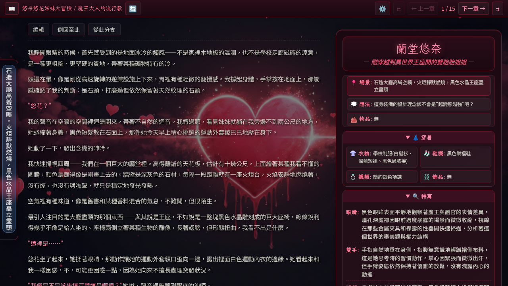
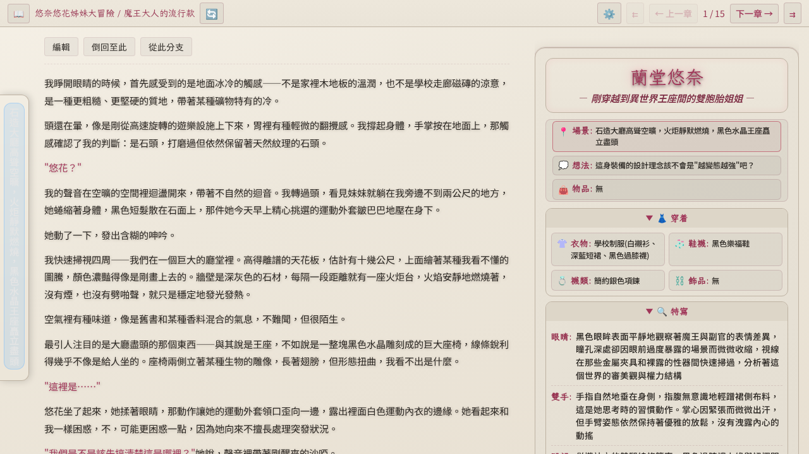
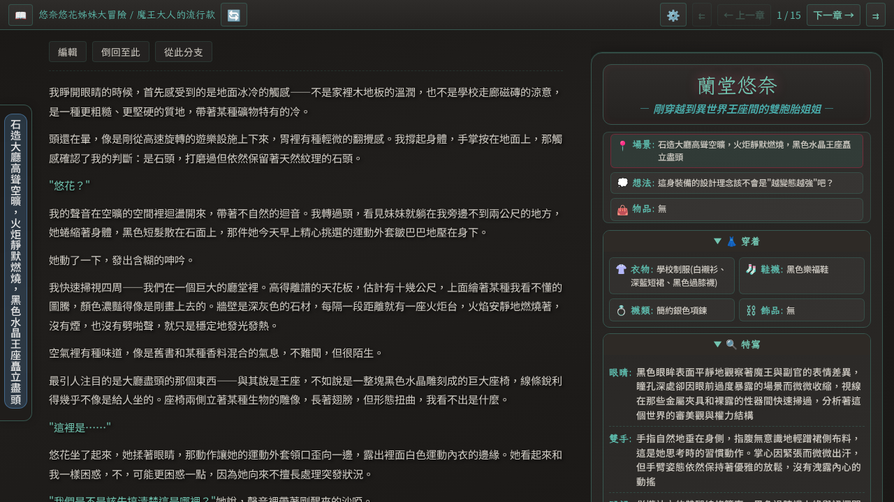

# HeartReverie 浮心夜夢

[](https://codecov.io/gh/jim60105/HeartReverie)
[](https://github.com/jim60105/HeartReverie/actions/workflows/ci.yaml)
[](https://github.com/jim60105/HeartReverie/releases)
[](./LICENSE)

<section align="center">
  
</section>

面向開發者的 AI 互動小說引擎，以 Markdown 檔案與外掛系統為核心。

HeartReverie 以「發展故事」為主軸，有別於 [SillyTavern][sillytavern] 以「對話」為核心的設計。你的輸入作為引導故事走向的指示，本身不會寫入故事內容。

整個專案圍繞純文字檔案設計，故事內容、提示詞、典籍系統等全部以 `.md` 檔案儲存，適合習慣 VSCode 等編輯器的開發者。提示詞骨架是一個 [Vento][vento] 模板 [`system.md`][system-md]，可注入 Markdown 片段作為模板變數，所有客製化皆可透過外掛系統完成。提供 [Agent Skill](#撰寫自訂外掛)，讓你用 AI 代理全自動產生外掛程式。

前端是 [Vue 3][vue]；後端使用 [Hono][hono]，串接 OpenAI 相容 API，將回應逐步寫入章節檔案。

## 🚀 快速開始

### 容器化部署

```bash
# 建立 .env（或複製 .env.example）
cat > .env << 'EOF'
LLM_API_KEY=your-api-key-here
PASSPHRASE=your-passphrase-here
EOF

podman run -d --name heartreverie \
  -p 8080:8080 \
  --env-file .env \
  -v ./playground:/app/playground:z \
  ghcr.io/jim60105/heartreverie:latest
```

### 本地部署

需要 [Deno][deno]。

```bash
# 建立 .env（或複製 .env.example）
cat > .env << 'EOF'
LLM_API_KEY=your-api-key-here
PASSPHRASE=your-passphrase-here
EOF

# 建置前端
deno install --lock=deno.lock
deno task build:reader

# 啟動
./scripts/serve.sh
```

伺服器預設跑在 `http://localhost:8080`，僅提供純 HTTP；若需要 TLS，請於上游反向代理或 Ingress controller 終結。

### 環境變數

| 變數 | 必要 | 預設值 | 說明 |
|------|:---:|--------|------|
| `LLM_API_KEY` | ✅ | — | LLM 提供者 API 金鑰 |
| `PASSPHRASE` | ✅ | — | 前端驗證用通關密語 |
| `PORT` | — | `8080` | 監聽埠號 |
| `LLM_MODEL` | — | `deepseek/deepseek-v3.2` | LLM 模型 |
| `LLM_API_URL` | — | `https://openrouter.ai/api/v1/chat/completions` | LLM 聊天完成端點 |
| `LLM_TEMPERATURE` | — | `0.1` | 取樣溫度 |
| `LLM_FREQUENCY_PENALTY` | — | `0.13` | 頻率懲罰 |
| `LLM_PRESENCE_PENALTY` | — | `0.52` | 存在懲罰 |
| `LLM_TOP_K` | — | `10` | Top-K 取樣 |
| `LLM_TOP_P` | — | `0` | Top-P（nucleus）取樣 |
| `LLM_REPETITION_PENALTY` | — | `1.2` | 重複懲罰 |
| `LLM_MIN_P` | — | `0` | Min-P 取樣 |
| `LLM_TOP_A` | — | `1` | Top-A 取樣 |
| `PLUGIN_DIR` | — | — | 外部外掛目錄（絕對路徑） |
| `PLAYGROUND_DIR` | — | `./playground` | 故事資料根目錄 |
| `READER_DIR` | — | `./reader-dist` | 前端靜態檔案根目錄 |
| `THEME_DIR` | — | `./themes/` | 主題檔案目錄 |
| `LOG_LEVEL` | — | `info` | 日誌等級：debug、info、warn、error |
| `LOG_FILE` | — | — | JSON Lines 日誌檔案路徑（啟用檔案日誌與自動輪替） |
| `PROMPT_FILE` | — | `playground/_prompts/system.md` | 自訂提示詞模板檔案路徑 |

### 主題系統

HeartReverie 支援透過 TOML 檔案自定義主題。主題檔案放在 `THEME_DIR` 指定的目錄下（預設 `./themes/`）。

內建三套主題：

| 心夢預設 (default) | 淡雅晨光 (light) | 靜夜深邃 (dark) |
|:---:|:---:|:---:|
|  |  |  |

#### 新增主題

建立一個 `.toml` 檔案，格式如下：

```toml
id = "my-theme"          # 必須與檔名相同（去除 .toml）
label = "我的主題"        # 下拉選單顯示名稱
colorScheme = "dark"     # "light" 或 "dark"
backgroundImage = ""     # 同源路徑或 data: URL，空字串表示無背景圖

[palette]
# 每個 CSS 自訂屬性（不含前綴 --）
panel-bg = "#1a1e24"
text-main = "rgba(220, 220, 215, 1)"
# ... 完整 36 個屬性請參考 themes/default.toml
```

重啟服務後新主題即可在「設定 → 主題」中選用。

## 🔌 外掛系統

每個外掛是一個資料夾加上一份 `plugin.json`，宣告它要做的事。系統有六層擴展點：

1. **提示詞注入**：`promptFragments` 把 Markdown 檔案映射成 Vento 模板變數，渲染時自動塞進提示詞
2. **提示詞標籤移除**：`promptStripTags` 告訴引擎在組建提示詞時從 previousContext（已儲存章節內容）中移除哪些 XML 標籤
3. **顯示標籤移除**：`displayStripTags` 告訴前端在瀏覽器渲染時移除哪些 XML 標籤，讀者不會看到這些內部標記
4. **後端掛鉤**：`backendModule` 透過 context 物件（含 hooks 與 logger）介入 `prompt-assembly`、`response-stream`、`pre-write`、`post-response`、`strip-tags` 五個階段
5. **前端模組**：`frontendModule` 在瀏覽器端透過 Vue composable 與 `frontend-render` 掛鉤處理自訂區塊渲染
6. **前端樣式注入**：`frontendStyles` 宣告 CSS 樣式表路徑，在前端載入時自動注入為 `<link>` 元素

完整文件請見 [`docs/plugin-system.md`][plugin-system-doc]。

### 選用外掛（推薦）

> [!TIP]
> **強烈建議搭配 [HeartReverie_Plugins][heartreverie-plugins] 使用。**  
> 這組選用外掛提供變數狀態追蹤、角色狀態面板、行動選項面板、破限等進階功能，能大幅提升互動體驗與故事品質。外掛獨立於主專案維護，使用者可依需求自由搭配。

```bash
git clone https://codeberg.org/jim60105/HeartReverie_Plugins.git
```

複製後設定環境變數並複製提示詞模板即可啟用：

- `PLUGIN_DIR`：指向該目錄的絕對路徑
- 將該目錄中的 `system.md` 複製至本專案根目錄覆寫預設提示詞

使用容器部署者可直接建置含外掛的延伸映像檔，詳見 [HeartReverie_Plugins README][heartreverie-plugins]。

完整外掛系統文件請見 [`docs/plugin-system.md`][plugin-system-doc]。

### 撰寫自訂外掛

建議使用 AI 代理搭配 `heartreverie-create-plugin` skill 來建立外掛。使用以下指令安裝 skill：

```bash
npx skills add https://github.com/jim60105/HeartReverie -s heartreverie-create-plugin
```

安裝後，在 AI 代理中啟用 `heartreverie-create-plugin` skill，它會引導你完成類型選擇、manifest 建立、提示詞片段、後端/前端模組、標籤設定與 README 撰寫。

## 📖 典籍系統（Lore Codex）

以檔案為基礎的世界觀知識庫。受 SillyTavern 世界書啟發，專為檔案工作流程設計。

- **三層作用域**：全域（`_lore/`）、系列（`<系列>/_lore/`）、故事（`<系列>/<故事>/_lore/`）與故事資料並置
- **Markdown 篇章**：`.md` 檔案 + YAML frontmatter（`tags`、`priority`、`enabled`）
- **標籤系統**：frontmatter 標籤 + 目錄即標籤 + 檔名即標籤，自動注入為 Vento 模板變數（`{{ lore_<tag> }}`）

完整文件請見 [`docs/lore-codex.md`][lore-codex-doc]。

## 🧪 測試

```bash
deno task test                                    # 全部
deno task test:backend                            # 僅後端
deno task test:frontend                           # 僅前端
```

## 🐳 容器部署

預建置映像檔發佈於 GitHub Container Registry：

```bash
podman run -d --name heartreverie \
  -p 8080:8080 \
  -e LLM_API_KEY=your-api-key \
  -e PASSPHRASE=your-passphrase \
  -v ./playground:/app/playground:z \
  ghcr.io/jim60105/heartreverie:latest
```

如需從原始碼自行建置：

```bash
podman build -t heartreverie:latest .
```

## ☸️ Helm 部署

Kubernetes 使用者可透過內附的 Helm chart 一鍵部署：

```bash
helm install hr ./helm/heart-reverie \
  --namespace heart-reverie --create-namespace \
  --set env.LLM_API_KEY=sk-... \
  --set env.PASSPHRASE=open-sesame
```

完整安裝指南、Ingress 範例（Traefik／nginx）、TLS／持續性／提示詞覆寫等進階情境請見：

- 中文指南：[`docs/helm-deployment.md`](docs/helm-deployment.md)
- Chart README（英文）：[`helm/heart-reverie/README.md`](helm/heart-reverie/README.md)

## 📄 授權


[GNU AFFERO GENERAL PUBLIC LICENSE Version 3][license]

Copyright (C) 2026 Jim Chen <Jim@ChenJ.im>.

This program is free software: you can redistribute it and/or modify it under the terms of the GNU Affero General Public License as published by the Free Software Foundation, either version 3 of the License, or (at your option) any later version.

This program is distributed in the hope that it will be useful, but WITHOUT ANY WARRANTY; without even the implied warranty of MERCHANTABILITY or FITNESS FOR A PARTICULAR PURPOSE. See the GNU Affero General Public License for more details.

You should have received a copy of the GNU Affero General Public License along with this program. If not, see <https://www.gnu.org/licenses/>.

[sillytavern]: https://github.com/SillyTavern/SillyTavern
[vento]: https://vento.js.org/
[hono]: https://hono.dev/
[vue]: https://vuejs.org/
[system-md]: system.md
[deno]: https://deno.com/
[plugin-system-doc]: docs/plugin-system.md
[heartreverie-plugins]: https://codeberg.org/jim60105/HeartReverie_Plugins
[lore-codex-doc]: docs/lore-codex.md
[license]: /LICENSE
