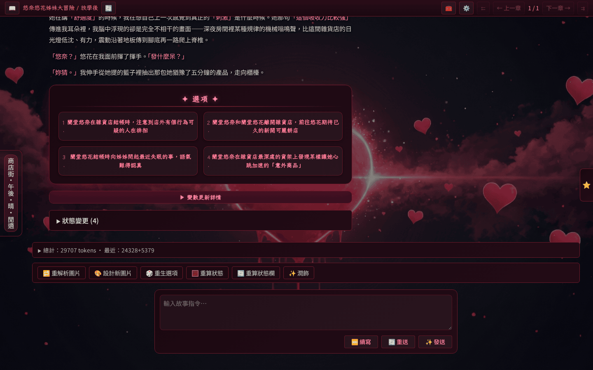

# 動作按鈕（作者視角）

動作按鈕是外掛在閱讀器主版面上貢獻的互動按鈕，位於 `MainLayout` 中 `UsagePanel` 與 `ChatInput` 之間的 `PluginActionBar`。本頁從作者角度說明何時會看到按鈕、如何使用；外掛開發細節請見[外掛開發者 → 動作按鈕][dev-action-buttons]。

## 何時會出現按鈕

`PluginActionBar` 在無任何外掛貢獻可見按鈕時不渲染任何 DOM。按鈕的可見性由外掛 `visibleWhen` 條件控制，常見值如下：

| `visibleWhen` | 何時可見 |
|---------------|----------|
| `always` | 永遠 |
| `last-chapter` | 當前章節是最新章節時 |
| `last-chapter-backend` | 最新章節且後端已寫入完畢時 |

常見內建外掛貢獻：

- `polish` → ✨ 潤飾按鈕（`last-chapter-backend`）
- `state` → 🧮 重算狀態（外部外掛）
- `options` → ✨ 選項面板（外部外掛）
- `sd-webui-image-gen` → 🎨 生成插圖（外部外掛）

<!-- screenshot-recipe see plugin-action-buttons.png -->

## 點選行為

按鈕被點選後流程：

1. 前端觸發 `action-button:click` hook，由貢獻該按鈕的外掛前端模組處理。
2. 前端呼叫 `POST /api/plugins/:pluginName/run-prompt`，後端以該外掛的提示詞檔案發起一次 LLM 回合。
3. 回應可選擇性以指定 XML 標籤包裹後寫入當前章節檔尾端，或以 `replace: true` 原子覆寫當前章節。

整個流程不需要使用者輸入額外指令，適合「失敗復原」「重算」「重新生成」等情境。

## 想自製按鈕？

請參考[外掛開發者 → 動作按鈕][dev-action-buttons] 的 manifest 欄位、後端 hook 與前端註冊方式說明。

[dev-action-buttons]: ../plugin-dev/action-buttons.md
