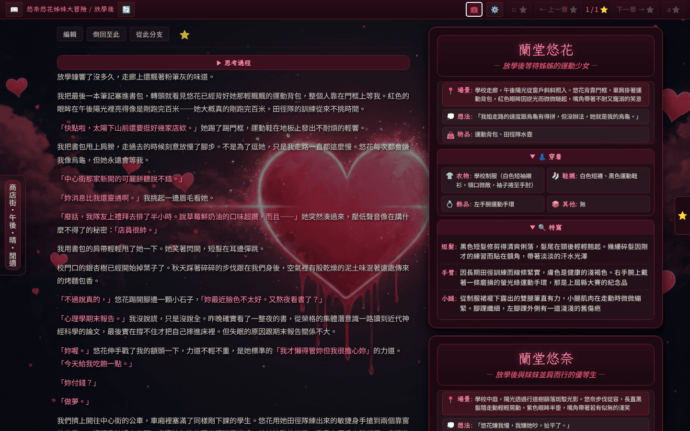
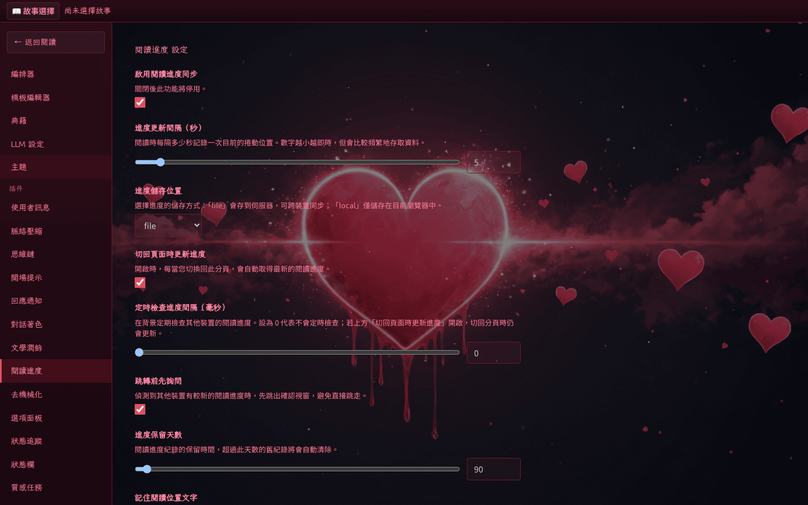

# 內建外掛一覽

[HeartReverie 浮心夜夢][project] 隨主程式內建 8 個外掛，於讀者端「設定 → 外掛」頁面直接顯示，無須額外掛載 `PLUGIN_DIR`。本頁逐一說明每個外掛的用途、何時啟用、可調設定欄位，並列出對應的截圖位置。每節的「設定欄位」表格直接對照 `plugins/<name>/plugin.json` 的 `settingsSchema`，欄位名稱、預設值與說明皆與後端實際讀取的鍵一致。

> [!NOTE]
> 內建外掛的提示詞內容固定為 SFW（Safe For Work）。需要 NSFW、越獄指令或年齡相關指示時，請透過外部外掛（`PLUGIN_DIR`）自行提供，避免污染本儲存庫。

外掛總表：

| 名稱 | 類型 | 一句話功能 |
|------|------|------------|
| context-compaction | full-stack | 長篇脈絡壓縮，自動摘要早期章節 |
| dialogue-colorize | frontend-only | 對話引號區段上色顯示 |
| reading-progress | full-stack | 章節閱讀進度跨裝置同步 |
| polish | full-stack | 一鍵文學潤飾改寫當前章節 |
| response-notify | frontend-only | LLM 回覆完成時觸發通知 |
| start-hints | prompt-only | 首回合開場引導注入 |
| thinking | full-stack | 思考指令注入與 `<thinking>` 摺疊渲染 |
| user-message | full-stack | 使用者輸入包裝為 `<user_message>` 標籤 |

每張設定頁截圖均沿用 [外掛設定][plugin-settings] 章節既有的 `plugin-settings-list.png` 與 `plugin-settings-detail.png`，避免重複擷取相同 UI。

## context-compaction（脈絡壓縮）

**類型**：full-stack（`backendModule: ./handler.ts`）。

**用途**：在 `prompt-assembly` 階段把較早的章節壓縮為摘要，再以 `previousContext` 寫回提示詞變數，避免章節數累積後撐爆 LLM 脈絡視窗。

**何時啟用**：故事章節超過數十章、單章字數偏大，或所選 LLM 視窗較小（如 32k token 以下）。

**設定欄位**（`plugins/context-compaction/plugin.json`）：

| 欄位 | 型別 | 預設值 | 說明 |
|------|------|--------|------|
| `enabled` | boolean | `true` | 是否啟用本外掛；關閉後等同未安裝。 |
| `recentChapters` | integer (≥1) | `3` | 保留原文的章節數。最近 N 章維持完整原文，更早章節改以摘要替換。數值越大越保留細節，但送入 LLM 的 token 也越多。 |

本外掛沒有獨立 UI 介面，只在「設定 → 外掛 → 脈絡壓縮」呈現上述兩個欄位，並透過 prompt 變數 `context_compaction` 把摘要注入模板。

## dialogue-colorize（對話著色）

**類型**：frontend-only（`frontendModule: ./frontend.js`、`frontendStyles: ./styles.css`）。

**用途**：透過 `chapter:dom:ready` / `chapter:dom:dispose` hook 註冊 CSS Custom Highlight API，把章節中配對成功的引號區段加上顏色，幫助讀者辨識對話文字。整個流程不改動 DOM，僅在樣式層加上 Highlight，章節切換時自動回收。

**何時啟用**：對話頻繁的故事、或想以顏色快速區分敘述與對話時。

**設定欄位**（`plugins/dialogue-colorize/plugin.json`）：

| 欄位 | 型別 | 預設值 | 說明 |
|------|------|--------|------|
| `enabled` | boolean | `true` | 是否啟用本外掛。 |
| `dialogueColor` | string | `""` | 對話文字套用的顏色。可填色碼（如 `#aa5500`）或顏色名稱（如 `blue`）。留空時沿用目前佈景主題的預設對話色。 |
| `enabledQuoteStyles` | string[] | `["straight","curly","guillemet","corner","corner-half","book"]` | 選擇要套色的引號類型；未勾選的引號內文字維持原色。 |

<!-- screenshot-recipe
schema: v1
url: http://localhost:8080/悠奈悠花姊妹大冒險/放學後/
viewport: 1440x900
theme: default
preconditions:
  - 容器已啟動於 localhost:8080
  - 已通過 PASSPHRASE 登入
  - dialogue-colorize plugin 已啟用
steps:
  - wait_for: 'main'
capture: viewport
output: docs/assets/screenshots/plugin-dialogue-colorize.png
captured_at: 2026-05-28
app_commit: 4534325
-->

## reading-progress（閱讀進度）

**類型**：full-stack（`frontendModule: ./frontend.js`、`backendModule: ./backend.ts`）。

**用途**：在閱讀章節時持續紀錄章節索引、捲動比例與選取錨點，再寫回伺服器或瀏覽器 storage。下次開啟同一故事，可從上次中斷處接續，也支援桌機與手機切換閱讀。

**何時啟用**：跨裝置閱讀、或長篇連載需要跨日恢復閱讀位置時。

**設定欄位**（`plugins/reading-progress/plugin.json`）：

| 欄位 | 型別 | 預設值 | 說明 |
|------|------|--------|------|
| `enabled` | boolean | `true` | 是否啟用閱讀進度同步。 |
| `syncIntervalSeconds` | number (1–60) | `5` | 閱讀時每隔幾秒記錄一次目前的捲動位置。 |
| `storageBackend` | enum (`file`/`local`) | `file` | 進度儲存位置。`file` 寫入伺服器以跨裝置同步，`local` 僅存於目前瀏覽器。 |
| `pollOnFocus` | boolean | `true` | 切回此分頁時自動取得最新進度。 |
| `pollIntervalMs` | number (0–600000) | `0` | 背景定期檢查其他裝置進度的間隔，毫秒；`0` 代表不主動輪詢。 |
| `confirmRemoteJump` | boolean | `true` | 偵測到較新進度時先彈出確認視窗，避免直接跳轉走失閱讀位置。 |
| `retainDays` | number (1–3650) | `90` | 進度紀錄保留天數，超過自動清除。 |
| `trackSelectionAnchor` | boolean | `true` | 額外記錄目前閱讀位置周邊的文字片段，跨裝置回復時更貼近原位。 |

<!-- screenshot-recipe
schema: v1
url: http://localhost:8080/settings/plugins/reading-progress
viewport: 1440x900
theme: default
preconditions:
  - 容器已啟動於 localhost:8080
  - 已通過 PASSPHRASE 登入
  - reading-progress plugin 已啟用
steps:
  - wait_for: 'main'
capture: viewport
output: docs/assets/screenshots/plugin-reading-progress.png
captured_at: 2026-05-28
app_commit: 4534325
-->

## polish（文學潤飾）

**類型**：full-stack（`frontendModule: ./frontend.js`，於 Writer 註冊動作按鈕）。

**用途**：在最後一章顯示「✨ 潤飾」按鈕（`visibleWhen: "last-chapter-backend"`、`priority: 200`），透過 `action-button:click` hook 呼叫 LLM，以 `replace: true` 原子覆寫目前章節，將草稿改寫為較具文學筆觸的版本。潤飾指令來自 `plugins/polish/polish-instruction.md`。

**何時啟用**：作者偏好快寫粗稿、再以潤飾按鈕統一文風的工作流程。

**設定欄位**（`plugins/polish/plugin.json`）：

| 欄位 | 型別 | 預設值 | 說明 |
|------|------|--------|------|
| `enabled` | boolean | `true` | 是否顯示「✨ 潤飾」按鈕並接受 `action-button:click` hook 觸發。 |

潤飾時實際使用的 LLM 模型沿用故事的 LLM 設定，沒有獨立模型欄位；要切換潤飾模型，請於 Writer 頁面的 LLM 覆寫面板修改。風格 prompt 由 `polish-instruction.md` 控制，作者如需自訂風格，可在外部外掛中覆寫同名檔案。

## response-notify（回應通知）

**類型**：frontend-only（`frontendModule: ./frontend.js`，註冊 `notification` hook）。

**用途**：LLM 章節寫入完成時於前端觸發通知，可走站內 toast 或瀏覽器 Notification API。長時間生成（搭配 thinking、context-compaction）時，作者可以切去做其他事再被叫回。

**何時啟用**：希望生成完成時即時收到提醒；或經常多分頁切換、生成時不盯著 Writer 的工作流。

**設定欄位**（`plugins/response-notify/plugin.json`）：

| 欄位 | 型別 | 預設值 | 說明 |
|------|------|--------|------|
| `enabled` | boolean | `true` | 是否啟用回應通知。 |
| `notifyTitle` | string | `"故事生成完成"` | 顯示在通知上的標題文字。 |
| `notifyBody` | string | `"新的章節已經寫入完成"` | 顯示在通知上的內文文字。 |
| `notifyWhenVisible` | boolean | `true` | 開啟時，頁面在前景以站內 toast 提示、切到背景才改用系統通知；關閉後僅於頁面在背景時提醒。 |
| `notifyLevel` | enum (`info`/`success`/`warning`) | `"success"` | 通知顯示樣式。 |

<!-- screenshot-recipe
schema: v1
status: planned
url: http://localhost:8080/悠奈悠花姊妹大冒險/放學後/
viewport: 1440x900
theme: default
preconditions:
  - 容器已啟動於 localhost:8080
  - 已通過 PASSPHRASE 登入
  - response-notify plugin 已啟用
  - notifyWhenVisible 設為 true
steps:
  - wait_for: 'main'
  - click: '[data-test="writer-generate"]'
  - wait_for: '.toast-success'
capture: viewport
output: docs/assets/screenshots/plugin-response-notify-toast.png
captured_at: TBD
app_commit: TBD
notes: 待生成完成 toast 出現後擷取；本回合不執行擷取，留待未來文件 enrichment pass。
-->

回應通知的 toast 與系統通知 UI 留待後續文件 enrichment pass 擷取，目前以上方 recipe 標記為 `status: planned`。

## start-hints（開場提示）

**類型**：prompt-only（`promptFragments` 注入 `start_hints` 變數）。

**用途**：偵測到首回合（`isFirstRound` 為 `true`）時，將 `start-hints.md` 的內容作為 `start_hints` 變數注入提示詞，引導 LLM 以開場白進入場景；對應的 `promptStripTags` 與 `displayStripTags` 把 `<start_hints>` 區塊從章節保存內容與讀者顯示中清除。

**何時啟用**：希望首章由 LLM 帶出場景、敘述者語氣、空間定位等開場資訊，而非由作者手寫第一段。

**設定欄位**（`plugins/start-hints/plugin.json`）：

| 欄位 | 型別 | 預設值 | 說明 |
|------|------|--------|------|
| `enabled` | boolean | `true` | 是否在首回合注入 `start_hints` 變數。 |

開場提示文字本身寫在 `plugins/start-hints/start-hints.md`，並非設定頁欄位。要客製文字，請於外部外掛覆寫同名檔案；或於模板中以條件分支自行排版。本外掛沒有 UI 介面，所有設定皆透過上方單一布林欄位控制。

## thinking（思維鏈）

**類型**：full-stack（`backendModule: ./handler.ts`、`frontendModule: ./frontend.js`）。

**用途**：在系統提示詞中加入「先思考再回覆」指令（來自 `think-before-reply.md`），並於前端 `frontend-render` hook 把 LLM 輸出中的 `<thinking>` 與 `<think>` 區塊摺疊為可展開的 `
` 元素。`tags: ["thinking", "think"]` 同時把標籤列入 placeholder 機制。

**何時啟用**：搭配 DeepSeek、OpenRouter reasoning 模型，或任何輸出推理區塊的 LLM；想閱讀時略過思考、需要除錯時再展開檢視。

**設定欄位**（`plugins/thinking/plugin.json`）：

| 欄位 | 型別 | 預設值 | 說明 |
|------|------|--------|------|
| `enabled` | boolean | `true` | 是否啟用思維鏈處理（注入指令與摺疊渲染）。 |
| `injectInstruction` | boolean | `true` | 是否在系統提示中加入「先思考再回覆」指令；關閉後仍會渲染既有 `<thinking>` 區塊。 |
| `defaultCollapsed` | boolean | `true` | 已完成的思考區塊預設為摺疊；進行中的思考仍展開顯示。 |
| `completeSummaryLabel` | string | `"思考過程"` | 思考完成後摺疊區塊的標題文字。 |
| `streamingSummaryLabel` | string | `"思考中..."` | 思考進行中、尚未結束時顯示的標題文字。 |

<!-- screenshot-recipe
schema: v1
status: planned
url: http://localhost:8080/悠奈悠花姊妹大冒險/放學後/
viewport: 1440x900
theme: default
preconditions:
  - 容器已啟動於 localhost:8080
  - 已通過 PASSPHRASE 登入
  - thinking plugin 已啟用
  - 章節內含 <thinking>...</thinking> 區塊
steps:
  - wait_for: 'details summary'
capture: 'selector:details'
output: docs/assets/screenshots/plugin-thinking-collapsed.png
captured_at: TBD
app_commit: TBD
notes: 待 reasoning 章節在 SFW playground 重現後擷取；本回合不執行擷取。
-->

摺疊後的 `
` 元素截圖留待後續 enrichment pass，目前以 `status: planned` 的 recipe 註記。

## user-message（使用者訊息）

**類型**：full-stack（`backendModule: ./handler.ts`，註冊 `pre-write` hook）。

**用途**：把作者於 Writer 輸入的引導訊息包裝成 `<user_message>` 標籤、寫入章節檔的 `preContent`，再透過 `promptStripTags` 與 `displayStripTags` 從提示詞與讀者顯示中清除。輸入內容能以結構化方式留在章節 metadata 中，後續章節可引用而不污染敘述本體。

**何時啟用**：希望保留作者輸入紀錄、或想於後續章節引用先前的使用者輸入時。

**設定欄位**（`plugins/user-message/plugin.json`）：

| 欄位 | 型別 | 預設值 | 說明 |
|------|------|--------|------|
| `enabled` | boolean | `true` | 是否啟用 `pre-write` hook、把使用者輸入寫入章節並從顯示中過濾。 |

本外掛在背景處理章節寫入與標籤過濾，沒有獨立 UI 介面；除設定頁上的「啟用」開關外，作者通常不需與其互動。

---

## 設定頁面總覽

所有外掛的設定頁面入口集中於「設定 → LLM 設定」左側選單，主區塊呈現選定故事的 LLM 覆寫欄位與外掛特定欄位。

單一外掛的設定詳細頁（以對話著色為例）：

延伸閱讀：[作者 → 外掛設定][plugin-settings]、[作者 → 動作按鈕][action-buttons]、[外掛開發者 → 總覽][plugin-dev]。

[project]: https://github.com/jim60105/HeartReverie
[plugin-settings]: plugin-settings.md
[action-buttons]: action-buttons.md
[plugin-dev]: ../plugin-dev/overview.md
