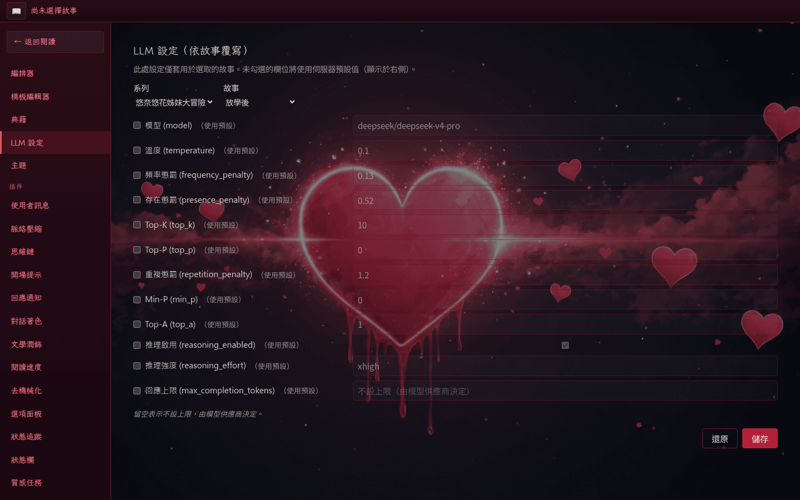
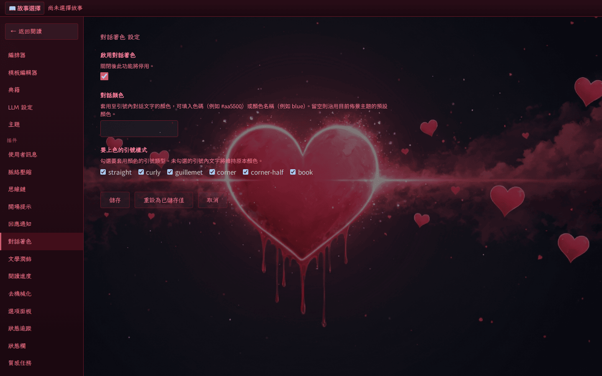

# 外掛設定

外掛若在 manifest 中宣告 `settingsSchema`，閱讀器會自動為它產生一個設定頁，並把設定值儲存於 `playground/_plugins/<pluginName>/config.json`，與其他使用者資料一起保留在 `PLAYGROUND_DIR`，可隨 playground 一起備份。

進入「設定 → LLM 設定」即可在左側選單瀏覽所有已註冊外掛的設定頁，並在主區塊調整套用於目前故事的 LLM 連線參數。

<!-- screenshot-recipe
schema: v1
url: http://localhost:8080/settings/llm
viewport: 1440x900
theme: default
preconditions:
  - 容器已啟動於 localhost:8080
  - 已通過 PASSPHRASE 登入
  - 已選取 SFW 故事作為作用中的故事
steps:
  - wait_for: 'nav'
capture: viewport
output: docs/assets/screenshots/plugin-settings-list.png
captured_at: 2026-05-28
app_commit: 4534325
notes: 左側為設定選單列出所有 plugin 設定入口；主區塊呈現以選取故事填入的 LLM 覆寫欄位
-->


點開單一外掛的設定頁，可依其 `settingsSchema` 渲染對應表單，欄位變動會即時寫入 `config.json`。

<!-- screenshot-recipe
schema: v1
url: http://localhost:8080/settings/plugins/dialogue-colorize
viewport: 1440x900
theme: default
preconditions:
  - 容器已啟動於 localhost:8080
  - 已通過 PASSPHRASE 登入
  - dialogue-colorize plugin 已啟用
steps:
  - wait_for: 'main'
capture: viewport
output: docs/assets/screenshots/plugin-settings-detail.png
captured_at: 2026-05-28
app_commit: 4534325
-->


## 設定值的存放位置

每個外掛的設定值寫入：

```
playground/_plugins/<pluginName>/config.json
```

備份 `playground/` 時，這些設定會一併保留；切換 `PLAYGROUND_DIR` 時，對應外掛的設定會跟著切換。

## 表單欄位的呈現方式

設定頁的欄位類型（文字、數字、下拉、多選、顏色、路徑選擇等）由外掛在 manifest 中宣告。常見的欄位行為：

- 標記為機密的欄位以遮罩顯示；留空表示維持原值，輸入空白字串表示清空。
- 條件可見性：某些欄位會依其他欄位的當前值出現或隱藏。
- 動態選項：下拉與多選的可選值可能由外掛後端即時提供。

外掛自身的開發細節（manifest schema、JSON Schema 子集、API 端點、widget 對照表）請見[外掛開發者 → Settings 開發指南][plugin-dev-settings]。

[plugin-dev-settings]: ../plugin-dev/settings.md
