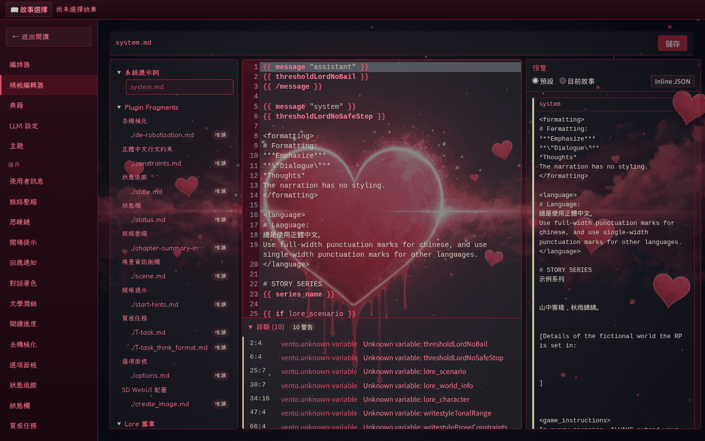

# Prompt 模板

> 本頁同時服務「想調整提示詞」的故事作者與「想理解模板架構」的外掛開發者；以作者視角為主，必要的開發內幕集中在本頁末段並連回[外掛開發者 → Hook 系統][hooks]。

[HeartReverie 浮心夜夢][project] 的提示詞由一份位於 playground 根目錄的 `system.md` 描述，內容是一段 [Vento][vento] 模板。引擎在每一次聊天請求渲染時，把核心變數（章節脈絡、使用者輸入、典籍變數）與外掛提供的具名變數一併傳入模板，渲染結果即為送往 LLM 的完整 `messages` 陣列。

## 模板架構概覽

`system.md` 位於 `playground/` 根目錄，是一份 [Vento][vento] 模板。引擎每次收到聊天請求時，會把章節脈絡（`previous_context`）、故事指令（`user_input`）、典籍（`lore_*`）與外掛提供的具名變數一併傳入，渲染後直接作為送往 LLM 的 `messages` 陣列。

例如下列片段會被渲染為一則 `user` 訊息，內容是當回合的故事指令：

```vento
{{ message "user" }}<user_intent>{{ user_input }}</user_intent>{{ /message }}
```

可用變數與完整渲染流程見後續章節。

## 模板變數

伺服器在渲染模板時傳入以下核心變數：

| 變數名稱 | 型別 | 說明 |
|---|---|---|
| `previous_context` | `string[]` | 已存在的章節內容陣列，按章節編號順序排列；內容經 `stripPromptTags()` 移除外掛定義的 XML 標籤後傳入 |
| `user_input` | `string` | 使用者在聊天請求中發送的原始訊息 |
| `isFirstRound` | `boolean` | 當所有章節內容皆為空時為 `true`，表示這是故事的第一回合 |
| `series_name` | `string` | 目前所選系列的名稱（與系列目錄名稱相同） |
| `story_name` | `string` | 目前所選故事的名稱（與故事目錄名稱相同） |
| `plugin_fragments` | `string[]` | 外掛透過 `promptFragments` 提供的內容片段陣列 |
| `lore_all` | `string` | 所有啟用的典籍篇章，依 priority 降冪排列後串接 |
| `lore_<tag>` | `string` | 帶有該有效標籤的啟用篇章串接 |
| `lore_tags` | `string[]` | 所有已發現的標籤名稱陣列 |

除上述核心變數外，外掛亦可透過 `promptFragments` 提供額外的具名變數；後端模組也可匯出 `getDynamicVariables()` 提供動態變數。典籍變數的產生規則請見[作者 → 典籍系統][lore-codex]。

## Vento 語法

### 變數插值

使用雙大括號 `{{ }}` 輸出變數值：

```vento
{{ lore_scenario }}
{{ user_input }}
```

### 陣列迭代

使用 `{{ for ... of ... }}` 走訪陣列：

```vento
{{ for chapter of previous_context }}
<previous_context>{{ chapter }}</previous_context>
{{ /for }}
```

外掛提供的內容片段也透過同樣語法注入：

```vento
{{ for fragment of plugin_fragments }}
{{ fragment }}
{{ /for }}
```

### 條件渲染

```vento
{{ if isFirstRound }}
<start_hints>第一回合的起始提示...</start_hints>
{{ /if }}
```

### `{{ message }}` 多訊息標籤

`{{ message }}` 是本專案註冊到 Vento 的自訂區塊標籤，用於在模板中宣告一則送往 LLM 的對話訊息。**渲染後的模板就是上游 `messages` 陣列的唯一來源**——伺服器不會在模板之外自動補上任何 `system` 或 `user` 訊息。

```vento
{{ message "system" }}你是一位敘事家。{{ /message }}
{{ message "user" }}{{ user_input }}{{ /message }}
{{ message "assistant" }}遵命。{{ /message }}
```

允許的角色僅限 `"system"` / `"user"` / `"assistant"`。也支援以**裸識別字**動態指定角色，識別字的執行期值必須是上述三者之一。需要以迴圈動態產出多則訊息時，**`{{ for }}` 必須放在 `{{ message }}` 區塊內側**：

```vento
{{ message "assistant" }}
{{ for chapter of previous_context }}
<previous_context>{{ chapter }}</previous_context>
{{ /for }}
{{ /message }}
```

> [!IMPORTANT]
> 不可把 `{{ for }}` 放在 `{{ message }}` **外側**包覆多個 `{{ message }}` 區塊。Prompt Editor 以「每個 `{{ message }}` 區塊一張卡片」的結構解析並序列化模板，外側迴圈在卡片解析時會被視為頂層內容處理而丟失。需要動態決定訊息數量的場景，請在單一 `{{ message }}` 內用 `{{ for }}` 串接內容，並改以 XML-like 區段標記區隔（如上例的 `<previous_context>`）。

> [!NOTE]
> 角色運算式只接受字串字面量或單一識別字，**不接受**管道（`|>`）、屬性存取（`obj.role`）或函式呼叫（`fn()`）。這是 SSTI 白名單刻意留下的限制。

#### 訊息順序與合併規則

1. 位於所有 `{{ message }}` 區塊**之外**的頂層文字會被視為 `system` 內容，依字面順序插入。
2. **相鄰的 `system` 訊息會被合併**為單一訊息，內容以 `\n` 串接。
3. **相同角色的非系統訊息（`user`/`assistant`）不會合併**。
4. **僅含空白字元的頂層片段會被丟棄**。

#### 限制

- **不可巢狀**：違反時 Vento 於**編譯期**丟出 `multi-message:nested`。
- **必須至少有一則 `user` 訊息**：否則伺服器以 `multi-message:no-user-message` 回 422 RFC 9457 Problem Details，並**不會**呼叫上游 LLM API。
- **無效角色於編譯期攔截**：字串字面量錯誤於編譯期、動態識別字錯誤於執行期。

#### 完整多輪範例

下列範例改寫自專案內建的 `system.md`，展示真實使用模式，頂層由四個 `{{ message }}` 區塊組成，`{{ for }}` 永遠在區塊內側。

```vento
{{ message "system" }}
你是一位專精於奇幻文學的敘事家，請以正體中文回覆。

# STORY SERIES
{{ series_name }}

# SCENARIO
<scenario>
{{ lore_character }}
</scenario>

{{ for fragment of plugin_fragments }}
{{ fragment }}
{{ /for }}
{{ /message }}

{{ message "assistant" }}
{{ for chapter of previous_context }}
<previous_context>{{ chapter }}</previous_context>
{{ /for }}
{{ /message }}

{{ message "system" }}
{{ if isFirstRound }}
{{ start_hints }}
{{ /if }}

{{ think_before_reply }}

{{ context_compaction }}
{{ /message }}

{{ message "user" }}<user_intent>{{ user_input }}</user_intent>{{ /message }}
```

#### 錯誤類型總覽

| 錯誤類型 | 觸發時機 | 偵測階段 |
|---|---|---|
| `multi-message:invalid-role` | 角色不是 `system`/`user`/`assistant` | 字串字面量於編譯期；識別字於執行期 |
| `multi-message:nested` | 巢狀的 `{{ message }}` 區塊 | 編譯期 |
| `multi-message:no-user-message` | 組裝後找不到 `user` 訊息 | 渲染後 |
| `multi-message:assembly-corrupt` | 內部哨兵索引損毀（一般不應出現） | 渲染後 |

所有錯誤皆透過 `buildVentoError()` 包裝為 RFC 9457 Problem Details，並由 Prompt Editor 的 `VentoErrorCard` 顯示對應修正建議。

### 區域變數與子模板的替代寫法

Vento 的 `set` / `/set` / `include` 區塊指令在本專案中**已被 SSTI 白名單封鎖**。需要等同功能時：

- **抽出一段 Markdown 重用** → 由外掛在 `promptFragments` 宣告該檔案，指定 `variable` 名稱，模板中以 `{{ my_instructions }}` 引用。
- **根據資料動態組裝字串** → 由外掛後端模組匯出 `getDynamicVariables()`，把計算好的字串回傳；模板僅做純插值。
- **暫存中間結果** → 改在資料來源端處理；模板層僅允許 `|> trim` 之類的管道過濾器。

範例：

```jsonc
// plugin.json
{
  "promptFragments": [
    { "file": "./snippet.md", "variable": "my_var", "priority": 100 }
  ]
}
```

```vento
{{ my_var }}
```

引擎會在渲染前讀取 `snippet.md` 並以 `my_var` 注入模板，行為與原本 `set` + `include` 等價，但不再經過樣板層的執行期表達式。

## 提示詞建構流程

以下描述從使用者發送請求到 LLM 收到提示詞的完整流程：

1. **接收請求**：客戶端 `POST /api/stories/:series/:name/chat`，請求主體 `{ message: "..." }`。
2. **準備資料**：讀取章節檔案（最多 200 章）、偵測第一回合、呼叫 `stripPromptTags()` 清理章節、載入狀態資料（`current-status.yaml`，或回退 `init-status.yaml`）。
3. **渲染模板**：`renderSystemPrompt()` 解析典籍變數、逐篇渲染典籍內容（以不可變的第一輪變數快照供 lore 篇章引用）、收集外掛變數、最後以 Vento 渲染主模板。
4. **組裝訊息陣列**：`splitRenderedMessages()` 以每次渲染專屬的 nonce 為標誌，將渲染輸出依字面順序拆解為訊息；`assertHasUserMessage()` 強制至少一則 `user`。
5. **發送至 LLM**：作為 OpenAI 相容 Chat Completions 請求的 `messages` 欄位串流發送，回應逐步寫入章節檔案。

> [!IMPORTANT]
> 使用者提供的覆寫模板會經過 `validateTemplate()` 白名單驗證，阻擋函式呼叫、屬性存取等不安全的表達式，防止 SSTI 攻擊。

## 典籍篇章的 Vento 渲染

典籍篇章本體（Markdown 部分）支援 Vento 語法，可引用其他篇章或脈絡變數（如 `series_name`、`story_name`）來動態產生內容。

可用變數：所有 `lore_*` 變數（第一輪快照，即渲染前的原始內容）、`series_name`、`story_name`。

範例：

```vento
角色所在的世界：{{ lore_setting }}
本系列：{{ series_name }}
```

**循環參照**：若篇章 A 引用 `lore_b`、篇章 B 也引用 `lore_a`，雙方都會看到對方的**原始**（未渲染）內容。此為不可變快照的確定性結果。

**錯誤處理**：若某篇篇章的 Vento 語法有誤，該篇章回退為原始內容，不會影響其他篇章或整體模板的渲染。

## 在 Prompt Editor UI 中編輯模板

`/settings/prompt-editor` 是修改 `system.md` 的主要入口。編輯器有兩種互斥模式：**結構化卡片模式**（預設）與**純文字模式**（raw fallback）。

### 結構化卡片模式

載入時，前端解析器將 `system.md` 拆解為訊息卡片清單；每個 `{{ message "<role>" }}…{{ /message }}` 區塊對應一張卡片。每張卡片包含：

- **傳送者** `<select>`（系統 / 使用者 / 助理；底層值為英文 `system` / `user` / `assistant`）。
- **內容編輯區** — `<textarea>`，內容即訊息區塊的原始 Vento 來源，隨內容自動伸縮（最少 3 行）。
- **「插入變數」輔助選單** — 從現有變數列表中選一個，以 `{{ var_name }}` 形式插入游標位置。
- **上移／下移／刪除** 按鈕。刪除採卡片內聯確認。

工具列提供「新增訊息」「儲存」「回復預設」「預覽 Prompt」與「進階：純文字模式」切換。儲存時將卡片清單序列化為 `{{ message "<role>" }}\n<body>\n{{ /message }}` 區塊，以單一空行分隔，並 `PUT /api/template`。

### 純文字模式（raw fallback）

純文字模式下，編輯器顯示完整 `system.md` 原始來源於單一 `<textarea>`，上方保留變數插入按鈕列。儲存時直接以 textarea 內容 `PUT /api/template`，不做序列化。

#### 自動切入純文字模式的情況

解析器偵測到下列情況時，會自動切換並顯示可關閉的警告橫幅：未配對的 `{{ message }}`／`{{ /message }}` 標籤、非允許角色、巢狀 `{{ message }}`、動態角色識別字、JavaScript 表達式逸脫 `{{> … }}`、`{{ echo }}…{{ /echo }}` 原始區塊。

使用者亦可隨時手動點選「進階：純文字模式」切換；於純文字模式下則改顯示「結構化模式」按鈕，再次點選以當前 textarea 內容重新解析。

### 有損正規化警告

卡片模式只能表達 `{{ message }}` 區塊；位於所有區塊**之外**的頂層內容處理規則：

- 第一個 `{{ message }}` 區塊**之前**的非空白頂層文字會合併為一張首位的 `system` 卡片。
- 區塊**之間**或**之後**的非空白頂層文字會在儲存時被捨棄；解析器回傳 `topLevelContentDropped = true`，卡片模式顯示**常駐**警告長條提示作者改用純文字模式。

### 儲存前驗證

卡片模式下「儲存」按鈕在下列情況停用並以 tooltip 說明原因：卡片清單為空、沒有任何 `role === "user"` 卡片、任一卡片內容 `trim()` 後為空。純文字模式不套用此驗證（作者可能透過 Vento 控制流程動態產生 `user` 訊息）。

## Template Editor

`/settings/template-editor` 是 writer 模式內的 Vento 模板 lint／preview／編輯工具，與 `/settings/prompt-editor` 互補：**Prompt Editor 編 message 卡片，Template Editor 編模板原始碼**。

頁面採三欄佈局：

1. **左欄 — 檔案樹**：列出可編輯的 `system.md`、所有外掛的 `promptFragments[].file`、以及三層 lore 篇章（global／series／story）。外掛 fragment 節點旁顯示**唯讀**徽章。
2. **中欄 — CodeMirror 6 編輯器**：內建 Vento tokenizer 與自動完成（從 `VENTO_HELPERS` const 取得 filter 列表）。`set` / `/set` / `include` / `{{> jsExpression }}` token 會被標為紅色錯誤。
3. **右欄 — 預覽**：對主模板與外掛片段以 `PromptPreview.vue` 渲染最終 messages 陣列；對 lore 條目回退為純 Markdown 區塊。

<!-- screenshot-recipe
schema: v1
url: http://localhost:8080/settings/template-editor
viewport: 1440x900
theme: default
preconditions:
  - 容器已啟動於 localhost:8080
  - 已通過 PASSPHRASE 登入
steps:
  - wait_for: 'nav'
capture: viewport
output: docs/assets/screenshots/template-editor-overview.png
captured_at: 2026-05-28
app_commit: 4534325
-->


### Lint diagnostics

每次編輯後，前端會把當前緩衝送到 `POST /api/templates/lint`，後端走 `ventoEnv.compile()` AST 路徑收集：

- `vento.unsafe-expression`：碰到 `set` / `/set` / `include` / `{{> jsExpression }}` 等被白名單拒絕的 token。
- `vento.unknown-variable`：AST walk 發現引用了不在 catalog 內的變數名稱。
- `vento.message-nested` / `vento.message-invalid-role`：`{{ message }}` 多訊息標籤的編譯期錯誤。

`POST /api/templates/lint` 支援兩種請求型態：

1. **Path-form**（Template Editor 頁面用）：`{ templatePath, source, series?, story? }`。後端透過 `parseTemplatePath()` 推導 `kind`、catalog 範圍與 lore scope。
2. **Source-form**（Prompt Editor 卡片、Lore Editor 草稿等虛擬位置用）：`{ kind, source, role?, scope?, series?, story?, pluginName? }`。`kind` 可為 `system` / `plugin-fragment` / `lore` / `prompt-message-body`。

`GET /api/templates/variables` 同樣支援 `kind` query param，讓 Prompt Editor / Lore Editor 各自獲得正確範圍的變數 catalog。

### `VentoCodeEditor` 共用元件

CodeMirror 6 + Vento 編輯器以 `VentoCodeEditor.vue` 形式釋出，三處消費：Template Editor 頁面、Prompt Editor 訊息卡片、Lore Editor 內文。公開 props 包含 `source, variables, templatePath?, kind?, role?, scope?, pluginName?, series?, story?, readOnly?, enableSaveShortcut?, enableLineNumbers?, disableLint?, lazyLint?, minLines?, maxLines?`。發射事件 `update:source`、`lint` 與 `save-request`。

### Preview 模式（三種 fixture mode）

`POST /api/templates/preview` 支援三種 fixture mode：

| Mode | 來源 | 用途 |
|------|------|------|
| `default` | `writer/fixtures/template-preview.json` 內建固定 fixture | 純函式渲染，最快、最無副作用 |
| `inline` | 前端傳入自訂 fixture 物件 | 模擬特定變數值 |
| `current` | 真實外掛 pipeline + 指定的 series／story 目錄 | 看「實際上會送到 LLM 的內容」 |

### 寫入流程（atomic + backup）

`PUT /api/templates` 對 `system.md` 與 lore 篇章採 atomic write：

1. 先呼叫 `validateTemplate()`；含非白名單 token → 回 `422`。
2. `Deno.lstat` 拒收 symlink target；若已存在則先複製到 `<target>.bak`（若 `.bak` 也存在則改用 `.bak.<timestamp>`）。
3. 寫入暫存檔 `<parent>/.<basename>.tmp.<uuid>`。
4. `Deno.rename` 至最終路徑（同 device 內 atomic）。

任何環節失敗都會在 `try/finally` 中清掉暫存檔。

### 外掛 fragment 為何 read-only？

外掛的 `promptFragments` 一律 read-only，須於外掛的 source repository 編輯。`PUT /api/templates` 收到 `templatePath` 以 `plugin:` 起頭時直接回 `403`，避免使用者編輯後與外掛 image 內容漂移。

## Lore 篇章可在 Template Editor 中編輯

典籍篇章（`.md` 檔，位於三層 `_lore/`）可在 Template Editor 中編輯。檔案樹會依 scope 分組列出：

| 路徑格式 | Scope | 實際檔案位置 |
|----------|-------|--------------|
| `lore:global:<rel>` | 全域 | `${PLAYGROUND_DIR}/_lore/<rel>` |
| `lore:series:<series>:<rel>` | 系列 | `${PLAYGROUND_DIR}/<series>/_lore/<rel>` |
| `lore:story:<series>:<story>:<rel>` | 故事 | `${PLAYGROUND_DIR}/<series>/<story>/_lore/<rel>` |

所有路徑解析都會經過 `realpath` 與目錄包含檢查，並拒收 symlink 與不合法的 `<series>`／`<story>` 段。

### 受限的變數 catalog

Lore 篇章在引擎中**早於**外掛 fragment 渲染，因此 lint catalog 只包含「第一輪 snapshot」變數：所有 `lore_*` 變數、`series_name`、`story_name`。**不包含**外掛提供的任何變數，也不包含 `user_input`、`previous_context`、`plugin_fragments`、`isFirstRound`。

### Lore 的 Preview 行為

對 lore 條目，`POST /api/templates/preview` 回傳 `kind: "markdown"` 與渲染後的字串，**不會**回傳 `messages[]` 陣列——lore 篇章本身不參與多訊息組裝，僅作為被注入到 `lore_*` 變數中的純文字內容。

[project]: https://github.com/jim60105/HeartReverie
[vento]: https://vento.js.org/
[hooks]: ../plugin-dev/hooks.md
[lore-codex]: lore-codex.md
