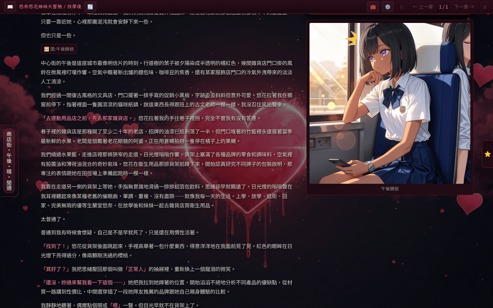

# Reader UI

Reader UI 是 HeartReverie 預設的閱讀模式。前端把章節 `.md` 檔逐章渲染成可捲動的長頁面，搭配 Plugin 提供的閱讀增強功能（對話高亮、閱讀進度同步、思考區塊摺疊等）。

## 進入 Reader UI

啟動服務後，瀏覽器打開 `http://localhost:8080`，輸入 `PASSPHRASE` 通關密語通過驗證，再從首頁挑選想閱讀的系列與故事，就會進到 Reader UI。網址形如 `/<series>/<story>`。

登入並通過驗證後，若尚未選擇故事，首頁會顯示載入提示與頂部的故事選擇下拉。

<!-- screenshot-recipe
schema: v1
url: http://localhost:8080/
viewport: 1440x900
theme: default
preconditions:
  - 容器已啟動於 localhost:8080
  - 已透過 set_passphrase 完成登入
  - 主題為 default（heartReverie.themeId = default）
  - 擷取前清空 origin http://localhost:8080 的 localStorage 與 sessionStorage，避免主題快取以外的歷史狀態殘留
  - 故事選擇下拉 (#story-selector-details) 維持預設摺疊狀態，畫面上 SHALL NOT 出現任何故事或系列名稱
steps:
  - set_local_storage: { key: 'heartReverie.themeId', value: 'default' }
  - wait_for: 'main'
capture: viewport
output: docs/assets/screenshots/reader-home.png
captured_at: 2026-05-28
app_commit: 4534325
notes: 首頁尚未選擇故事的初始狀態；應用本身不持久化最近開啟故事清單，仍以清空 storage 維持擷取的決定性
-->

選擇故事後即進入章節閱讀畫面。下圖為章節 1 的畫面，可看到頁首的章節導覽列、工具與設定按鈕，以及章節主體內文。

<!-- screenshot-recipe
schema: v1
url: http://localhost:8080/悠奈悠花姊妹大冒險/放學後/
viewport: 1440x900
theme: default
preconditions:
  - 容器已啟動於 localhost:8080
  - 已通過 PASSPHRASE 登入
  - 章節 1 已建立於 SFW 故事中
steps:
  - wait_for: 'main'
capture: viewport
output: docs/assets/screenshots/reader-chapter-view.png
captured_at: 2026-05-28
app_commit: 4534325
-->

## 介面組成

Reader UI 由幾個主要區塊組成：

- **章節主體**：將 `playground/<series>/<story>/*.md` 依章節編號順序渲染。Plugin 可透過 `displayStripTags` 在前端渲染前移除特定 XML 標籤的內容，讀者不會看到這些內部標記。
- **使用者輸入框**：頁面底部的輸入框；輸入後送出，引擎會以這段內容作為 `user_input` 變數渲染 prompt，接著呼叫 LLM 把新章節寫進檔案。
- **🧰 工具選單**：頁首的工具圖示，提供「快速新增」與「ST 角色卡轉換工具」等輔助功能，詳見 [Tools 選單](tools-menu.md)。
- **設定**：在頁首打開設定面板可調整主題、外掛開關與 Plugin 各自的設定項目；設定變更即時生效。

## 與 Plugin 的互動

Plugin 可以在 Reader UI 注入自己的 UI 區塊，最常見的是動作按鈕（Action Buttons）。按鈕由 Plugin 的 `actionButtons` manifest 欄位宣告，前端會渲染在 `PluginActionBar` 中。點選後觸發 `action-button:click` hook，可呼叫 `runPluginPrompt()` 把自訂 prompt 接回章節檔案。詳見[動作按鈕](../plugin-dev/action-buttons.md)。

Plugin 也可以在前端 hook（`frontend-render`、`pre-write`、`response-stream` 等）中即時處理 DOM，例如 `dialogue-colorize` 用 CSS Custom Highlight API 為對話引號高亮，`thinking` 把 `<think>` 區塊摺疊起來。完整的前端 hook 列表請見[前端 Render 生命週期](../plugin-dev/frontend-register.md)。
