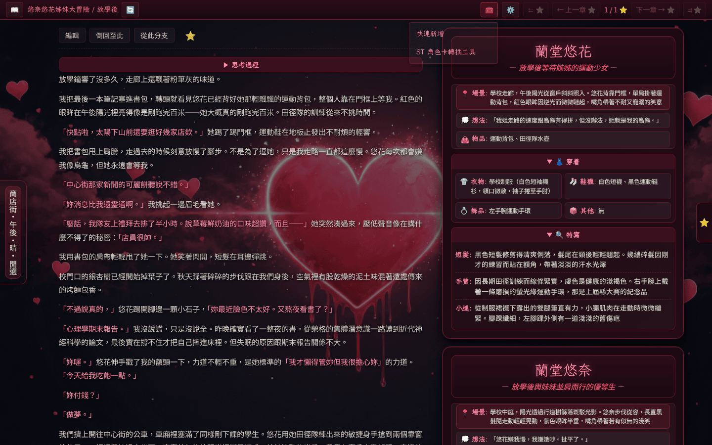
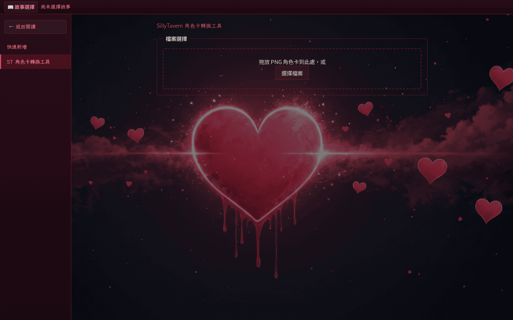

# Tools 選單

閱讀／章節頁面頁首的 🧰 圖示會展開工具下拉面板，目前提供兩項輔助工具：

- **快速新增**（`/tools/new-series`）：以單一表單建立新系列／故事，並可選擇性同步建立角色 lore 檔與世界篇章 lore 檔。
- **ST 角色卡轉換工具**（`/tools/import-character-card`）：解析 SillyTavern V2/V3 PNG 角色卡，將欄位轉為可編輯表單後寫入故事的 `_lore/` 範圍。

直接造訪 `/tools` 會自動導向 `/tools/new-series`，並以左側側邊欄列出兩項工具入口。

<!-- screenshot-recipe
schema: v1
url: http://localhost:8080/悠奈悠花姊妹大冒險/放學後/
viewport: 1440x900
theme: default
preconditions:
  - 容器已啟動於 localhost:8080
  - 已通過 PASSPHRASE 登入
  - 章節 1 已建立於 SFW 故事中
steps:
  - wait_for: 'main'
  - click: 'button[title="工具"]'
capture: viewport
output: docs/assets/screenshots/tools-menu.png
captured_at: 2026-05-28
app_commit: 4534325
-->

「快速新增」表單一次完成系列、故事與相關 lore 檔的建立，免去手動拼湊目錄結構。

<!-- screenshot-recipe
schema: v1
url: http://localhost:8080/tools/new-series
viewport: 1440x900
theme: default
preconditions:
  - 容器已啟動於 localhost:8080
  - 已通過 PASSPHRASE 登入
capture: viewport
output: docs/assets/screenshots/tools-new-series.png
captured_at: 2026-05-28
app_commit: 4534325
-->

「ST 角色卡轉換工具」會把 SillyTavern PNG 卡片解析成可編輯欄位，再寫入 `_lore/`，跳過手動複製貼上。

<!-- screenshot-recipe
schema: v1
url: http://localhost:8080/tools/import-character-card
viewport: 1440x900
theme: default
preconditions:
  - 容器已啟動於 localhost:8080
  - 已通過 PASSPHRASE 登入
capture: viewport
output: docs/assets/screenshots/tools-import-character-card.png
captured_at: 2026-05-28
app_commit: 4534325
-->

