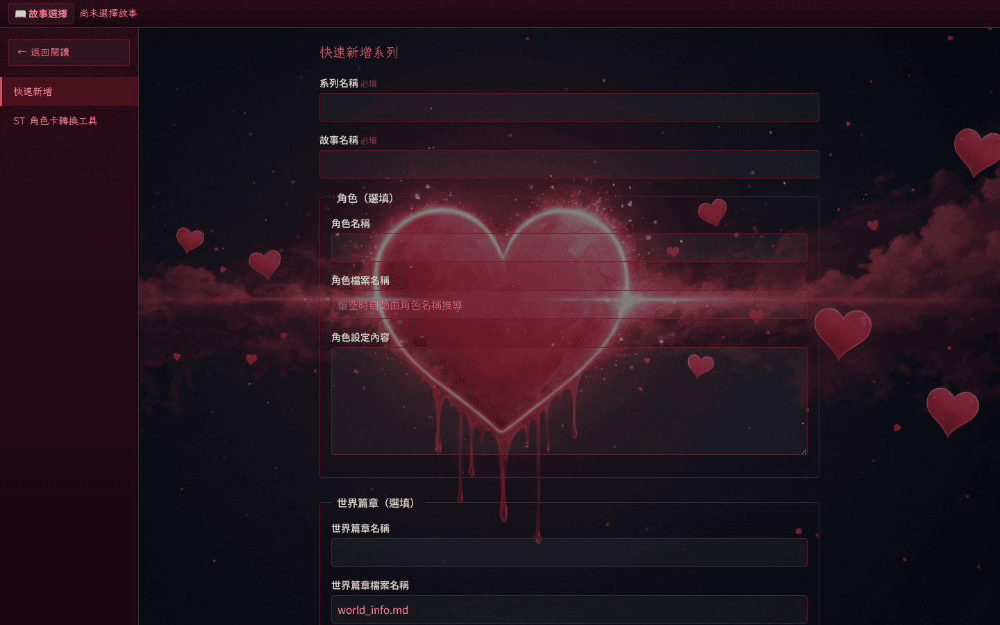
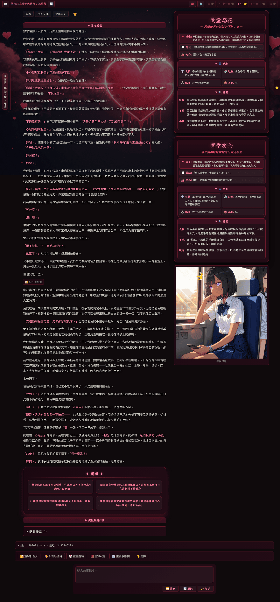
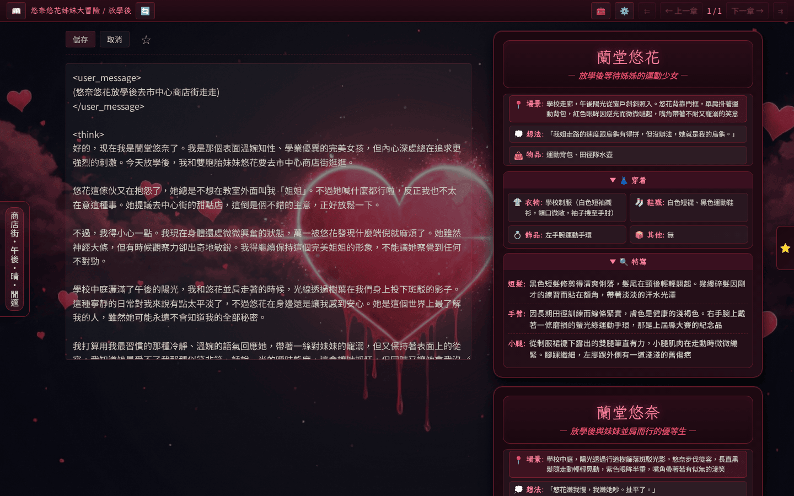

# 快速部署

本頁帶讀者用七個步驟，從零跑起 [HeartReverie 浮心夜夢][project] 至寫下第一章。流程從拉取鏡像、設定密語、登入、建立系列，一直到撰寫章節、觸發 AI 生成、可選載入外掛等等。

## 前置條件

- 已安裝 Podman 或 Docker；本頁範例以 Podman 撰寫。
- 8080 連接埠未被占用，或自行調整 `-p` 對應埠。
- 一組 OpenAI 相容 LLM API 金鑰，本專案推薦使用 [OpenRouter][openrouter]。

## 流程

1. **取得容器鏡像**：從 GitHub Container Registry 拉取最新版預建置鏡像。

    ```bash
    podman pull ghcr.io/jim60105/heartreverie:latest
    ```

2. **執行容器並設定 `PASSPHRASE`**：把 `LLM_API_KEY` 與 `PASSPHRASE` 放進 `.env`，掛載 `playground/` 作為持久化資料目錄，啟動容器。

    ```bash
    cat > .env << 'EOF'
    LLM_API_KEY=sk-...
    PASSPHRASE=your-secret-phrase
    EOF

    podman run -d --name heartreverie \
      -p 8080:8080 \
      --env-file .env \
      -v ./playground:/app/playground:z \
      ghcr.io/jim60105/heartreverie:latest
    ```

    <!-- screenshot-recipe
    schema: v1
    purpose: 終端機 podman run 啟動容器輸出
    output: docs/assets/screenshots/first-deploy-terminal.png
    captured_at: planned
    -->
    *（截圖待補：`first-deploy-terminal.png` — 終端機顯示 `podman run` 啟動後的 container id 與 log。）*

3. **以密語登入 Reader 首頁**：開啟 `http://localhost:8080`，輸入步驟 2 設定的 `PASSPHRASE`。

    <!-- screenshot-recipe
    schema: v1
    purpose: 登入畫面輸入密語
    output: docs/assets/screenshots/first-deploy-login.png
    captured_at: planned
    -->
    *（截圖待補：`first-deploy-login.png` — 登入畫面輸入密語狀態。）*

    通過驗證後即可看到 Reader 首頁。

    

4. **於 Tools 選單建立第一個系列／故事**：按頁首🧰圖示展開 Tools 選單，進入「快速新增」（路由 `/tools/new-series`），填入系列名稱與故事名稱送出，引擎會在 `playground/<系列>/<故事>/` 建立對應目錄與空白 `01.md`。

    <!-- screenshot-recipe
    schema: v1
    purpose: 初次部署且尚未建立任何系列時展開 Tools 選單的空白狀態
    status: planned
    output: docs/assets/screenshots/tools-menu-empty.png
    -->
    *（截圖待補：`tools-menu-empty.png` — 全新部署下展開 Tools 選單的空白狀態，無任何既有系列。）*

    

5. **描述故事發展的方向**：回首頁選擇剛建立的系列／故事，於頁面底部的「輸入故事指令」輸入框寫下故事接下來想要的發展意圖，例如「主角走進咖啡廳，點了一杯拿鐵後遇見舊識」。這段內容會以 `user_input` 傳給 AI 作為敘事引導，本身不會被寫進章節檔。

    

6. **觸發一次 AI 生成**：按下右下角「✨ 發送」按鈕，引擎呼叫 LLM 並以串流方式把回應寫入下一章。寫入完成後可在章節工具列點「編輯」直接修訂 AI 產出的內容。

    

7. **可選：載入一個外掛展示擴充性**：把 [HeartReverie_Plugins][hrp] 儲存庫掛載至容器內並以 `PLUGIN_DIR` 環境變數指向該路徑，重啟容器即可載入額外外掛。詳見[自架站 → 安裝][installation] 的 `PLUGIN_DIR` 段落，與[外掛開發者 → 總覽][plugin-dev-overview] 的擴充點介紹。

完成上述七步後，已具備閱讀、撰寫、AI 生成、外掛擴充四個面向的最小可用環境。

[project]: https://github.com/jim60105/HeartReverie
[openrouter]: https://openrouter.ai/
[hrp]: https://codeberg.org/jim60105/HeartReverie_Plugins
[installation]: ../self-host/installation.md
[plugin-dev-overview]: ../plugin-dev/overview.md
