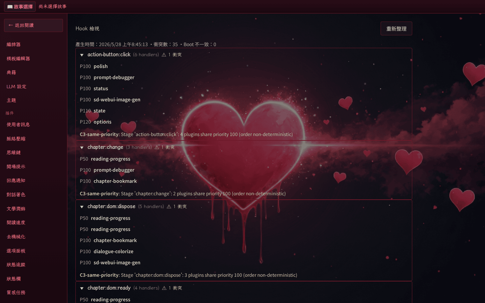

# Hook Inspector

Hook Inspector 是一套**啟動期一致性檢查 + 執行期觀測**機制，協助 plugin 作者及部署者快速確認後端／前端 hook 是否如預期註冊，並偵測多 plugin 之間可能的衝突。

## Manifest 欄位：`hooks`

`plugin.json` 可宣告 plugin 預期註冊的 hook 階段陣列：

```json
{
  "name": "my-plugin",
  "displayName": "我的外掛",
  "hooks": [
    { "stage": "post-response", "reads": ["content", "usage", "endpoint", "source"] },
    { "stage": "frontend-render" }
  ]
}
```

- `stage`（必填）：hook 階段名稱（後端或前端皆可）。
- `reads` / `writes`（選填）：宣告該 handler 會讀取／寫入的 pipeline 欄位，供衝突偵測使用。**注意**：`post-response` 的 payload 為 deep-frozen，handler 無法修改任何欄位，因此該 stage 不應宣告 `writes`。

**嚴格宣告／註冊一致性**：系統會於 plugin 載入後比對「manifest `hooks` 宣告 vs 實際 `hooks.register()` 呼叫」。若有差異，plugin 載入會被回滾並寫入 `declaredOnly`／`registeredOnly` 的錯誤訊息。

Plugin **必須**宣告 `hooks` 欄位（可為空陣列），並使 `register()` 內每個 `hooks.register(stage, ...)` 對應到 manifest 中的條目。

## Hook Inspector 頁面

瀏覽器內進入「設定 → 開發者工具 → Hook Inspector」（路由 `/settings/hook-inspector`），需通過通行碼驗證。頁面以 stage → handler 樹狀結構顯示：

<!-- screenshot-recipe
schema: v1
url: http://localhost:8080/settings/hook-inspector
viewport: 1440x900
theme: default
preconditions:
  - 容器已啟動於 localhost:8080
  - 已通過 PASSPHRASE 登入
  - 至少有一個 plugin 已註冊 hooks
steps:
  - wait_for: 'main'
capture: viewport
output: docs/assets/screenshots/hook-inspector.png
captured_at: 2026-05-28
app_commit: 4534325
-->



- 後端／前端各階段已註冊的 handler（plugin 名稱、priority、`errorCount`「自上次重啟以來」累計）。
- 衝突告警（C1：兩個 plugin 對同一欄位都宣告 `writes`；C2：讀取了沒人寫入的欄位；C3：同一 `(plugin, stage)` 重複註冊；C4：宣告與註冊不符）。
- Strip-tag 宣告（哪個 plugin 管理哪些標籤）。
- 啟動期 mismatch 摘要（若有）。

頁面右上角的「重新整理」按鈕重新拉取 `/api/plugin-introspection/hooks`。每次成功取得資料後，前端會以 `frontendHooks.dispatch("hook-inspector:report", payload)` 派發 [`hook-inspector:report`](#typed-events) 事件，方便其他 plugin（例如告警 logger）訂閱。

## CLI：`deno task introspect:hooks`

容器內可執行：

```bash
podman exec heartreverie deno task introspect:hooks
```

輸出為單一 JSON 物件，欄位包含 `backend`、`frontend`、`manifestDeclarations`、`stripTags`、`pipelineFields`、`generatedAt`，供 CI 或第三方工具消費。stderr 會輸出 plugin 載入 log，stdout 維持純 JSON。

## Typed events

Plugin 可在前端訂閱：

```javascript
window.HeartReverie.hooks.register("hook-inspector:report", (report) => {
  console.log("conflicts:", report.conflicts);
  console.log("backend handlers:", report.backend);
});
```

`payload` 型別與 Hook Inspector 頁面顯示的資料一致。companion plugin `hook-inspector-logger`（位於 `HeartReverie_Plugins/`）展示了一個最小訂閱者實作。

[prompt-template]: ../author/prompt-template.md
[lore-codex]: ../author/lore-codex.md
